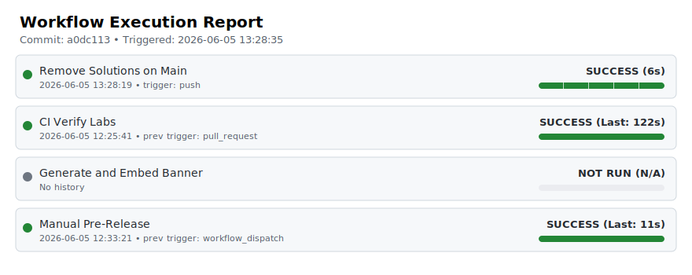

<!-- BANNER_START -->
<p align="center">
  
</p>
<!-- BANNER_END -->

<!-- telemetry-svg-start -->

<!-- telemetry-svg-end -->
# BrokenOps

BrokenOps is a Linux-focused DevOps and sysadmin training platform. It launches intentionally broken virtual machines, gives the user a browser-based terminal into the environment, and verifies whether the repair actually solved the problem.

The project is built around native KVM and libvirt. It is meant to run on a real Linux host with access to `/dev/kvm` and the libvirt socket.

## What it does

- Launches disposable lab VMs from cloud-init driven definitions under `labs/`
- Provides an in-browser terminal for troubleshooting and repair
- Exposes service ports for labs that include web or network checks
- Runs verification scripts against the live VM
- Tracks completed labs locally in the frontend

## Platform requirements

BrokenOps is not a generic Docker-only web app. The VM workflow depends on native Linux virtualization.

- Supported host model: native Linux with KVM and libvirt
- Not officially supported: WSL2, Docker Desktop-backed Linux setups, and most nested virtualization environments
- Frontend note: the current UI is desktop-oriented

If Docker Desktop is installed on Linux, it can intercept the deployment and place the backend inside Docker Desktop's internal VM, which breaks the required libvirt socket mapping. In that case, run deployment against the native Docker socket:

```bash
DOCKER_HOST=unix:///var/run/docker.sock ./deploy.sh
```

## Architecture

- `frontend/`
  React 19 + Vite interface for the dashboard, lab workspace, and terminal view
- `backend/`
  FastAPI application for lab discovery, VM lifecycle management, verification, and websocket terminal access
- `labs/`
  Self-contained lab definitions, broken-state setup, verification, and solutions
- `ansible/setup.yml`
  Host dependency bootstrap used by the deployment flow
- `scripts/test_labs.py`
  CI-style verifier for exercising labs after the stack is running

## Repository layout

```text
backend/                 FastAPI app and libvirt orchestration
frontend/                React/Vite user interface
labs/<lab-id>/           Individual lab definitions
ansible/setup.yml        Host setup tasks
scripts/test_labs.py     Lab verification runner
deploy.sh                Main local deployment entrypoint
LAB_FORMAT.md            Lab authoring guide
```

## Quick start

1. Clone the repository:

```bash
git clone https://github.com/HimanM/BrokenOps.git
cd BrokenOps
```

2. Run the deployment script:

```bash
./deploy.sh
```

The deployment flow:

- runs the Ansible host setup tasks
- prepares the `.env` file used by Docker Compose
- downloads required base images when needed
- starts the backend and frontend containers

3. Open the UI at:

```text
http://localhost:80
```

If you choose a different frontend port during deployment, use that instead.

## Development

Frontend:

```bash
cd frontend
npm install
npm run lint
npm run build
```

Full stack:

```bash
./deploy.sh
```

Lab verification after the stack is running:

```bash
python scripts/test_labs.py --key keys/id_ed25519 --labs <lab-id>
```

## Writing labs

Each lab lives under `labs/<lab-id>/` and should remain self-contained.

Typical lab contents:

- `lab.yaml`
- `cloud-init.yaml`
- `verify.sh`
- `solution.sh`
- `question.md`
- `solution.md`

Use [LAB_FORMAT.md](./LAB_FORMAT.md) for the lab authoring format and expectations.

## Operational notes

- Treat this project as host-integrated infrastructure software, not a lightweight frontend app
- VM launch, SSH access, verification, and network behavior all depend on a healthy local libvirt/KVM setup
- CI can validate parts of the system, but local host configuration still matters for end-to-end VM execution

## License

See the repository license information if present in this project.
